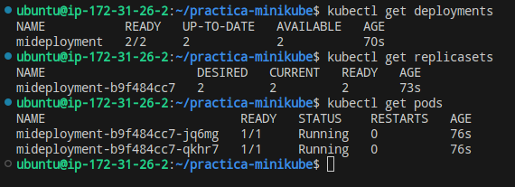
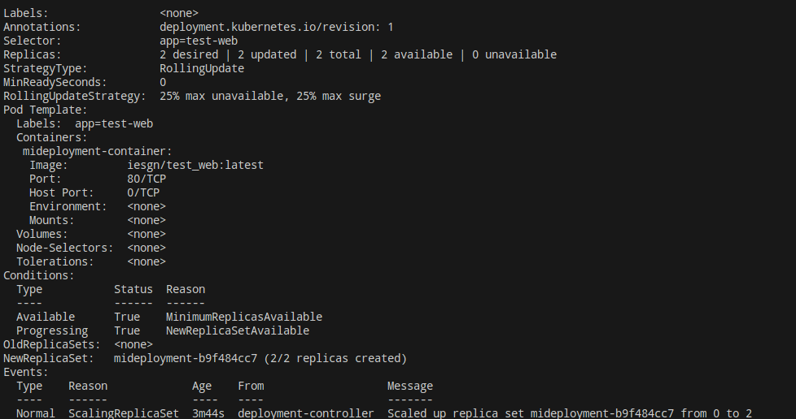
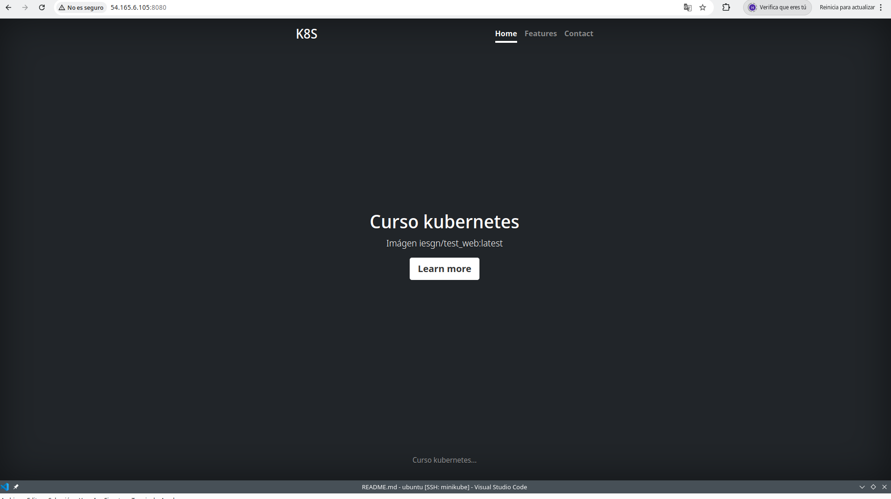

# Práctica Minikube

## Requisitos previos
Para realizar esta práctica, debemos tener Minikube instalado. 

1. Nos dirigimos a la carpeta `scripts`, luego a `driver_none` y ejecutamos el siguiente comando para instalarlo:
   ```bash
   sudo ./install_all.sh
   ```
2. Luego, agregamos nuestro usuario al grupo `docker` con:
   ```bash
   newgrp docker
   ```
3. Iniciamos Minikube con el driver `none` usando:
   ```bash
   ./start_minikube_driver_none.sh
   ```

Podemos verificar que Minikube está funcionando correctamente con:
```bash
minikube status
```

---

## Crear nuestro Deployment
Una vez que tengamos Minikube instalado y funcionando, creamos nuestro Deployment con el siguiente archivo YAML:
```yaml
apiVersion: apps/v1
kind: Deployment
metadata:
  name: mideployment
spec:
  replicas: 2
  selector:
    matchLabels:
      app: test-web
  template:
    metadata:
      labels:
        app: test-web
    spec:
      containers:
      - name: mideployment-container
        image: iesgn/test_web:latest
        ports:
        - containerPort: 80
```

Guardamos este archivo como `deployment.yaml` y luego lo aplicamos con:
```bash
kubectl apply -f deployment.yaml
```

---

## Comprobar los recursos creados
Una vez que hayamos creado el Deployment, verificamos los recursos creados con:
```bash
kubectl get deployments
kubectl get replicasets
kubectl get pods
```
Este comando nos mostrará los despliegues activos, los ReplicaSets generados y los Pods en ejecución.

Ejemplo de salida esperada:


---

## Obtener información detallada del Deployment
Para ver más detalles del Deployment creado, ejecutamos:
```bash
kubectl describe deployment test-web-deployment
```
Este comando nos proporciona información detallada como eventos, estado actual, replicas activas y posibles errores.

Ejemplo de salida esperada:


---

## Acceder a la aplicación con `port-forward`
Para acceder a la aplicación desde el navegador, usamos `port-forward`:
```bash
kubectl port-forward deployment/test-web-deployment 8080:80 --address 0.0.0.0
```
Esto redirige el puerto 80 del contenedor al puerto 8080 en nuestra máquina. Ahora, podemos abrir en un navegador:
```
http://localhost:8080
```
Si todo está correcto, veremos nuestra aplicación ejecutándose.

Ejemplo de salida esperada:


---

## Explicación de los comandos usados
1. **`kubectl apply -f deployment.yaml`** → Aplica el archivo YAML para crear el Deployment.
2. **`kubectl get deployments`** → Muestra los Deployments activos en el clúster.
3. **`kubectl get replicasets`** → Lista los ReplicaSets creados para administrar los Pods.
4. **`kubectl get pods`** → Muestra los Pods en ejecución.
5. **`kubectl describe deployment test-web-deployment`** → Muestra información detallada del Deployment.
6. **`kubectl port-forward deployment/test-web-deployment 8080:80 --address 0.0.0.0`** → Redirige el puerto del contenedor a nuestra máquina local.
